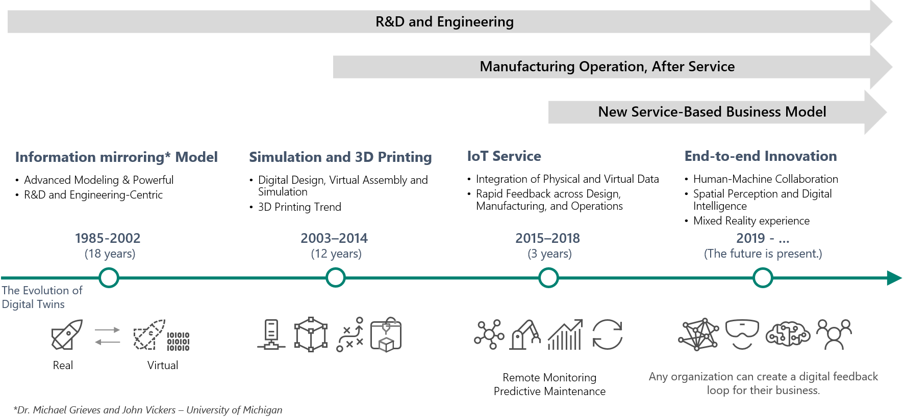
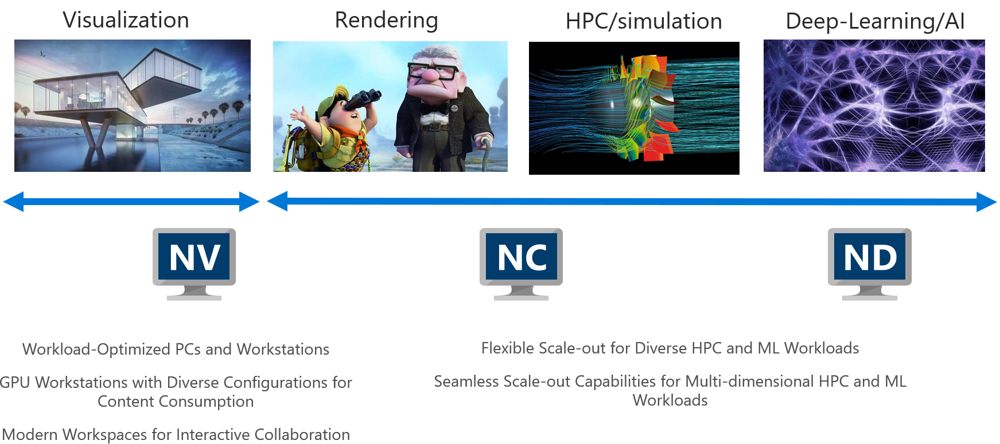
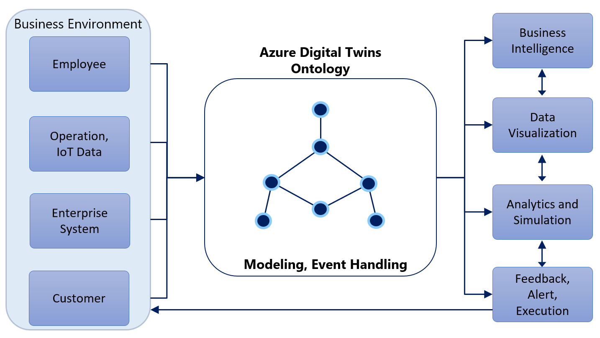
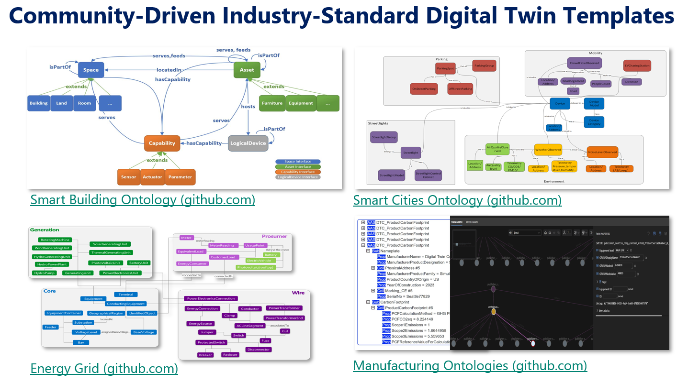
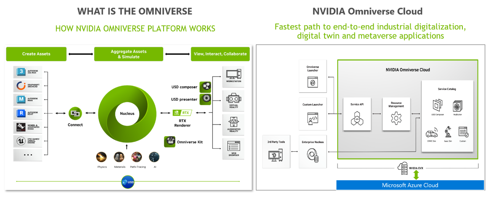
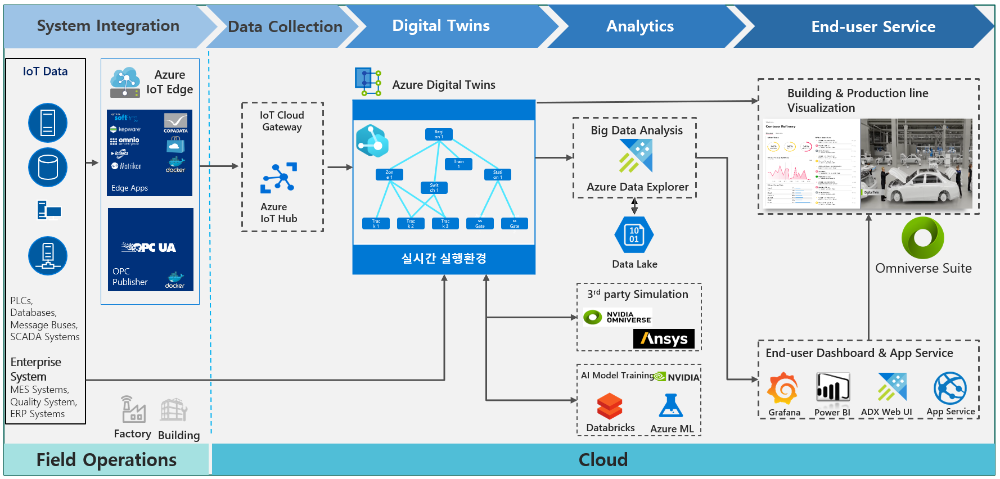

# Microsoft x NVIDIA – 클라우드 기반의 디지털 트윈 전략

> 🇺🇸 [Read in English](README.md)

---

| | |
|:---|:---|
| **저자** | 강경민 |
| **GitHub** | [github.com/min-hol-repo](https://github.com/min-hol-repo) |
| **역할** | Sr. Cloud Solution Architect at Microsoft |
| **전문 분야** | 클라우드 기반 데이터 분석을 위한 HPC 및 스마트 팩토리 기술 지원 |
| **소개** | 제조 환경에서 클라우드 기반 디지털 트윈을 구현하기 위한 Microsoft Azure와 NVIDIA Omniverse 활용 전략을 소개합니다. |
| **작성일** | 2023년 7월 12일 |

---

## 목차

- [클라우드 기반의 디지털 트윈의 진화](#클라우드-기반의-디지털-트윈의-진화)
- [온톨로지(Ontology) 중심의 디지털 피드백 순환](#온톨로지ontology-중심의-디지털-피드백-순환)
- [Azure Digital Twins와 NVIDIA Omniverse의 클라우드 기반의 디지털 트윈](#azure-digital-twins와-nvidia-omniverse의-클라우드-기반의-디지털-트윈)
- [클라우드 기반의 단계별 디지털 트윈 구현](#클라우드-기반의-단계별-디지털-트윈-구현)
- [HPC를 활용한 디지털 트윈 분석 및 시뮬레이션 구현](#hpc를-활용한-디지털-트윈-분석-및-시뮬레이션-구현)
- [맺음말](#맺음말)

---

## 클라우드 기반의 디지털 트윈의 진화

최근 많은 기업에서 관심을 가지고 있는 디지털 트윈은 2000년대 초 연구개발과 엔지니어링 분야에서 제품 중심으로 시작되었다. 2002년 미시간 대학교의 PLM 과정에서는 미러 공간 모델(Mirrored Spaces Model)로 소개되었고, 물리적 시스템과 물리적 시스템의 모든 정보를 포함하는 가상의 시스템을 의미하였다.

2000년대 초중반을 지나면서 많은 기업들이 3D캐드를 도입하기 시작하였고, 3D 중심의 엔지니어링과 제조 중심의 디지털 트윈이 성행하였다. 기업들은 제품 양산 전에 제품에 대한 3D 디지털 목업(Digital Mockup)을 가지게 되었고, 이를 통해서 실측과 동일한 3D 제품을 가상 조립 시뮬레이션과 3D 모델 기반 해석에 활용하였다. 엔지니어링 분야에서 시작된 제품 중심의 3D 도입은 제조 분야에서도 3D 기반의 디지털 공정 설계로 확산이 되었고 3D 모델과 3D 프린팅을 활용한 적층 제조(Additive Manufacturing)도 트렌드를 형성하였다.

2010년대 중반부터 제조 분야에 IoT(Internet of Things) 기술과 CPS(Cyber Physics System)의 개념이 접목이 되면서 제조의 물리세계와 가상세계를 데이터 기반으로 유기적으로 통합하는 기술이 발전하였다. CPS 용어는 디지털 트윈(Digital Twin) 개념으로 통합되어 현재까지 발전되고 있고 제조 분야의 IoT 기술은 IIoT(Industrial Internet of Things)로 개념으로 진화하였다. 이 시기에는 제조 공정을 운영하면서 발생하는 실시간 데이터들을 IoT 기술을 통해 실시간으로 모니터링하고, 축적된 데이터를 머신러닝(Machine Learning)을 통해 예측 모델을 만들어 예지보전을 하는 연구가 활발하게 진행되었다. 이 과정에서 기존 제조 분야에 적용되었던 SCADA(Supervisory Control And Data Acquisition)와 같은 기술로는 단일 공장 대상으로는 데이터 수집과 모니터링이 가능하였으나 물리적으로 떨어져 있는 원격지나 타 국가 공장 라인들의 데이터를 통합 수집하여 활용하는 부분에서는 기술적인 어려움에 직면하였다. 이에 대한 대안으로 자연스럽게 클라우드(Cloud) 기반의 IIoT가 발전하기 시작하였고 마이크로소프트와 같은 클라우드 공급 회사들도 제조 분야에 진입하여 클라우드 기반의 IoT와 빅데이터 및 AI 플랫폼을 공급하는 계기가 되었다.

2010년대 후반부터 현재에 이르기까지 가상현실(Virtual Reality) 및 혼합현실(Mixed Reality)들이 발전하면서 가상의 공간에서 상호 작용하는 메타버스(Metaverse) 기술들이 발전하고 있다. 특히 NVIDIA와 같은 회사들은 GPU를 기반으로 산업용 메타버스 애플리케이션을 설계, 개발, 배포 및 관리할 수 있는 클라우드 기반의 플랫폼을 제공하고 있다.

> *그림 1 – 디지털 트윈의 진화*

---

## 온톨로지(Ontology) 중심의 디지털 피드백 순환

제조 과정에서의 여러 사물들을 유연하고 효과적으로 구현하기 위해 온톨로지 기반의 디지털 트윈 모델이 오픈 커뮤니티 중심으로 확산되고 있다. 그림 2는 Azure Digital Twins에서 제공하는 온톨로지 중심의 디지털 피드백 순환을 보여준다. 온톨로지는 사물의 속성과 관계를 데이터 기반의 객체로 표현하여 관계를 그래프 형태로 정의한 것이다.

> *그림 2 – 온톨로지 중심의 디지털 피드백 순환*

오픈 커뮤니티인 디지털 트윈 컨소시엄(Digital Twins Consortium)에서 많은 회사들이 참여하여 온톨로지의 스펙과 산업별 온톨로지 템플릿을 발전시키고 있다. 특히 온톨로지를 기술하는 언어인 DTDL(Digital Twins Definition Language)은 디지털 트윈 모델과 인터페이스를 기술하는 디지털 트윈 구현 언어로 커뮤니티에 개방되어 있어 특정 솔루션에 종속되어 있지 않아 여러 산업군과 솔루션에 확산되고 있다.

각 산업군에서는 DTDL을 통해서 해당 산업군에 적합한 공용 온톨로지 템플릿을 그림 3과 같이 커뮤니티를 통해 발전시키고 있다. 산업군별 온톨로지를 활용하면 무수히 많은 객체와 관계들을 일일이 정의할 필요없이 여러 회사와 단체의 경험을 반영한 DTDL 기반의 산업별 표준 템플릿을 활용하여 체계적인 데이터 기반의 디지털 트윈을 쉽고 빠르게 구축할 수 있다. 마이크로소프트에서 운영하는 오픈소스 커뮤니티인 Github.com에서 스마트 빌딩, 스마트 시티, 에너지, 제조 등 기업의 산업군에 맞는 온톨로지 템플릿을 다운받아서 Azure Digital Twins 및 호환 가능한 솔루션에 산업 모델을 적용하여 구축할 수 있다.

> *그림 3 – 산업별 공용 온톨로지 템플릿*

---

## Azure Digital Twins와 NVIDIA Omniverse의 클라우드 기반의 디지털 트윈

마이크로소프트에서 제공하는 Azure Digital Twins는 데이터 기반의 디지털 트윈 플랫폼이다. 현장에서 활용되는 엣지(Edge), IoT, Azure Digital Twins 기술을 통해서 실시간 데이터에 대한 데이터 기반 디지털 트윈 구축을 지원하는 플랫폼을 제공한다.

NVIDIA Omniverse 클라우드는 마이크로소프트 Azure 클라우드 기반으로 제공된다. NVIDIA의 Omniverse 클라우드는 제조 계획부터 실행에 이르기까지 전체 제조 프로세스를 지원하는 솔루션이다. NVIDIA의 강점인 GPU를 기반으로 실사에 가까운 가상의 디지털 트윈을 구축하는 솔루션과 시뮬레이션 및 외부 시뮬레이션 연계 기능을 제공한다. 외부 시뮬레이션 솔루션에서 작업한 결과는 NVIDIA Omniverse 클라우드의 Nucleus와 연계하여 배포할 수 있다. NVIDIA Omniverse on Azure Cloud는 2023년 하반기 출시 예정이다.

> *그림 4 – NVIDIA Omniverse on Azure · [nvidia.com/ko-kr/omniverse](https://www.nvidia.com/ko-kr/omniverse/)*

---

## 클라우드 기반의 단계별 디지털 트윈 구현

공정에서 발생하는 데이터는 정적인 데이터와 동적인 데이터로 구분할 수 있다. 제품 양산 이전에 생산 계획을 하는 단계의 데이터들은 정적인 데이터로 분류된다. 반면에 제품 양산이 시작되고 제품 라인이 가동되면서 발생하는 데이터들은 동적인 데이터로 정의할 수 있다.

| 데이터 유형 | 설명 |
|:---|:---|
| **정적 데이터** | 제품 양산 이전 생산 계획 단계에서 생성되는 데이터 |
| **동적 데이터** | 제품 양산 이후 라인 가동 중 실시간으로 발생하는 측정 데이터 |

동적인 데이터는 측정에 초점을 맞춘다. 생산 계획 단계에서 각 공정이나 설비에 부여한 KPI를 실제로 어느정도 달성하는지는 성과를 정량적으로 측정하게 되는데, 각 KPI 달성여부는 제품 생산을 하면서 나오는 데이터들을 종합하여 판단할 수 있다. 이때 데이터의 수집은 엣지 컴퓨팅(Edge Computing) 기반의 IoT 기술과 기간 시스템과의 데이터 인터페이스를 통해서 클라우드로 수집된다. 축적된 데이터를 활용하여 시뮬레이션이나 AI 모델 학습을 통해서 데이터 기반으로 예측 서비스를 구축할 수 있다. 실제 사용자들에게 대시보드나 NVIDIA에서 제공하는 3D 환경 내에서 서비스가 제공된다.

> *그림 5 – 클라우드 기반의 단계별 디지털 트윈 구현 예시*

---

## HPC를 활용한 디지털 트윈 분석 및 시뮬레이션 구현

클라우드 기반 디지털 트윈의 시뮬레이션과 예측 분야 구현을 위해서는 GPU를 활용한 데이터 분석이 필수적이다. 클라우드 서비스는 셀프 서비스이기 때문에 분석하고자 하는 용도에 따라 적합한 GPU 선택이 필수적이다. Azure 클라우드에서는 NVIDIA가 제공하는 다양한 GPU 기반의 HPC를 제공하고 있다. 예를 들면 AI 학습을 위한 GPU와 학습된 AI 모델을 추론에 활용하는 GPU는 각각 다르게 선택해야 비용 효율적으로 AI 서비스를 구현할 수 있다.

> *그림 6 – 사용 요건에 따른 다양한 Azure HPC 클라우드 서비스*

---

## 맺음말

많은 국내 기업들이 제조 분야에 디지털 트윈 도입을 검토하지만 구축과 방향성 수립에 어려움을 겪고 있다. 제조 프로세스 전체에 걸친 디지털 트윈은 구축 사례가 드문 도전적인 과제이다. 새로운 시도는 항상 실패를 동반한다. 필요시에 빠르게 활용하고 변경 사용이 유연한 클라우드 서비스는 기업이 여러가지 시도를 할 수 있고, 풍부한 인프라 자원을 활용하여 고품질의 시스템을 구축할 수 있는 적합한 플랫폼이다.

현대에 이르러 패권 국가들은 국방력뿐만 아니라 경제적인 부분을 활용하고 있고 국내 제조 산업에 많은 영향을 주고 있다. 미국과 같은 국가는 인플레이션 감축 법안의 일부로 IRA(Inflation Reduction Act)를 통해 미국 내에서 생산된 친환경 제품에 대해서만 세금 혜택을 제공하여 자국 내 친환경 관련 제조 산업 역량을 강화하고 있다. 따라서 친환경 사업에 진출하는 한국 기업들은 대미 수출을 위해 기존 공급망과 제조 역량을 재조정할 필요가 있다. 신규 현지 공장을 구축 시 사전에 가상의 환경에서 계획하고 실행을 검증하는 디지털 트윈은 이와 같은 시장 변화에 기업이 신속하게 대응하고 대처하는 경쟁력이 될 것이다.
